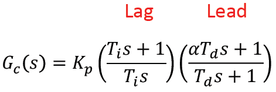

# Lab 4: UR5 and Motor Control

2.12/2.120 Intro to Robotics  
Spring 2026[^1]

- [Lab 4: UR5 and Motor Control](#lab-4-ur5-and-motor-control)
  - [0 (Prelab) Software Setup](#0-prelab-software-setup)
    - [0.1 Python & RTDE Library](#01-python--rtde-library)
    - [0.2 (Recommended for Windows Machines) Windows Subsystem for Linux (WSL)](#02-recommended-for-windows-machines-windows-subsystem-for-linux-wsl)
    - [0.3 UR_RTDE Installation Instructions for Mac](#03-ur_rtde-installation-instructions-for-mac)
  - [1 Motor Modelling and Controller Design](#1-motor-modelling-and-controller-design)
  - [2 Validate Hardware Setup](#2-validate-hardware-setup)
    - [2.1 Validate Microcontroller](#21-validate-microcontroller)
    - [2.2 Validate Motors](#22-validate-motors)
    - [2.3 Validate Encoders](#23-validate-encoders)
    - [2.4 Validate Joystick](#24-validate-joystick)
  - [3 Tune Controller](#3-tune-controller)
  - [4 Drawing Revisited](#4-drawing-revisited)
  - [5 Feedback Form](#5-feedback-form)
  - [X Optional](#x-optional)

## 0 (Prelab) Software Setup

Estimated time of completion: 15 min

Before coming in to lab, please download and install the following software.

### 0.1 Python & RTDE Library

1. Download Python here: https://www.python.org/downloads/.
    <details>
    <summary><i> What version of Python do I need? </i></summary>

    We recommend at least 3.10 to ensure compatibility with the packages we will use in this class. If you already have Python, you should be able to check its version by entering the command `python --version` (on Windows) or `python3 --version` (on Mac/Linux) in your terminal. 

    </details>

    <details>
    <summary><i> Can I get Python via conda? </i></summary>

    We recommend getting vanilla Python. The staff may not be able to help troubleshoot issues relating to `conda`.

    </details>

2. Make sure to check "Add python.exe to PATH" (on Windows).
  
    <p align="center">
    
    </p>

3. Click "Install Now" and finish the installation. On Mac, follow the instructions to install SSL certificates by opening the `Install Certificates.command` file in the installation folder.
4. Check that you installed Python correctly by entering the command `python` (on Windows) or `python3` (on Mac/Linux) in your terminal. It should return `Python X.X (tags...`.  To exit from running Python in your Terminal, enter the command `quit`.
    <details>
    <summary><i> It's returning something else? </i></summary>

    If it instead returns `python is not recognized as an internal or external command, operable program, or batch file` or `python: command not found`, you may have forgotten to add Python to PATH during installation. You can fix this using the following instructions: [How to Add Python to PATH](https://realpython.com/add-python-to-path/).

    </details>
5. Install pip:

    If you just installed Python, it may have come with pip. You can check if you have pip installed by running `C:> py -m ensurepip --upgrade` (Windows) or `python -m ensurepip --upgrade` or `python3 -m ensurepip --upgrade` (Mac/Linux). If you don't have pip already, follow these instructions:

    **Windows/Mac**
    - Click on this link: https://bootstrap.pypa.io/get-pip.py
    - Save the file (CTRL + s) to your computer
    - Open a terminal/command prompt and navigate to the same directory as the saved script (e.g. via `cd "C:\Users\*your username*\Downloads"` if you saved it in your downloads folder)
    - Run `python get-pip.py`
    
    **Linux**
    - Enter the following sequentailly:
        ```
        sudo apt update
        sudo apt upgrade
        sudo apt install python3-pip
        ```

6. Install the RTDE library by followiing the steps here: [ur_rtde Installation](https://sdurobotics.gitlab.io/ur_rtde/installation/installation.html). It might work for some Mac or Windows machines to simply run `pip install ur_rtde`, but if not follow the instructions from the link. If the Windows installation feels complex for you, look at section 0.2 below. Mac installations should follow section 0.3 below.

Additional references:
- [Github (Example Codes)](https://github.com/mit212/ur_2026)
- [RTDE API Doc](https://sdurobotics.gitlab.io/ur_rtde/)

In lab, we will perform a supervised run-through of controlling the UR5.

### 0.2 (Recommended for Windows Machines) Windows Subsystem for Linux (WSL)

**If you have a Windows machine, it is much easier to install ur_rtde through the Linux virtual environment for Windows (WSL). This is OPTIONAL but recommended.**

For Windows: 
1. Open PowerShell in administrator mode by right-clicking and selecting "Run as administrator".
2. Enter `wsl --install`. This installs Windows Subsystem for Linux (WSL) with Ubuntu as the default distribution.
   
    <details>
    <summary><i> Not working? </i></summary>

    Please refer to this tutorial: [How to install Linux on Windows with WSL](https://learn.microsoft.com/en-us/windows/wsl/install.).
    </details>

3. Restart your machine.
4. Open Powershell and enter `wsl` to open a WSL terminal window. If Ubuntu hasn't been installed already, Windows will install it in another terminal window. Wait until after this is completed and type `wsl` into PowerShell again. You might be asked to create a username and password. This can be whatever you want as long as you remember it.
5. Enter the following sequentially:
    ```
    sudo apt update
    sudo apt upgrade
    sudo apt install python3-pip
    pip3 install ur_rtde --break-system-packages
    ```
    Tip: You can paste text from your clipboard by right-clicking in Powershell.

### 0.3 UR_RTDE Installation Instructions for Mac
1. Install Homebrew if you don't have it already. Follow the instructions at https://brew.sh.
	- Follow the "next steps" at the end of the installation to add Homebrew to your PATH
2. On Mac, the ur_rtde library is only able to be installed in Python 3.11 and earlier. To see what version(s) of Python you have installed, in Terminal type `python` and then press the Tab key a few times. If you don't have an earlier version of Python installed already, you can download the latest available 3.11 installer here: https://www.python.org/downloads/release/python-3119/ (click 'Download macOS 64-bit universal2 installer' at the bottom of the page)
3. Install Boost using Homebrew: 
	- Open Terminal and enter `brew install boost`
4. Install CMake **using Homebrew** (this will ensure that the path configuration is handled automatically):
	- Enter `brew install cmake` in Terminal.
	- Check that cmake was successfully installed by running `cmake --version` in Terminal.
5. Navigate to your root folder (or the location where you want to place the ur_rtde folder) by entering `cd ~` in Terminal.
6. We will now follow the instructions under Build on the ur_rtde website *with two critical components added*. Clone the git repo by executing these lines in Terminal one at a time:
    ```
    git clone https://gitlab.com/sdurobotics/ur_rtde.git
    cd ur_rtde
    git submodule update --init --recursive
    ```
7. Now, open Finder and navigate to the `ur_rtde` folder that you just created. Open `CMakeLists.txt`. Find the line that begins with `find_package(Boost` using Cmd+F. **Delete "`system`" from this line.**  Save `CMakeLists.txt` and close the file.
8. Return to Terminal. Execute the remaining commands to build and install the ur_rtde library, **noticing that the `cmake ..` line has an additional flag**:
	```
    mkdir build
	cd build
	cmake -DCMAKE_POLICY_VERSION_MINIMUM=3.5 ..
	make
	sudo make install
    ```
9. Look at the output in the Terminal window and note where the ur_rtde library was installed. The library only supports Python versions up to 3.11; if your installation failed, try first installing Python 3.11 (see Step 2 above) and then try building ur_rtde again.
10. If all went well, ur_rtde should be installed! Test it out by running `test_import.py` from the example code repo [here](https://github.com/mit212/ur_2026).
- Note: if the Python version that ur_rtde installed into is different from your *default* Python, you will need to run programs that use the ur_rtde library by:
    - using the correct version number in your Python call, e.g., `python3.11 test_import.py`, or 
    - using a virtual environment or version manager like pyenv, or
    - changing your default Python version

## 1 Motor Modelling and Controller Design

Estimated time of completion: 40 min

Clone this repository. Open `src/matlab/MotorModel.mlx` in MATLAB and follow along the guided tutorial to find the nominal controller gains for the motors.

You can find information about the motor here: https://www.gobilda.com/5000-series-12vdc-motor/

| :white_check_mark: CHECKOFF 1 :white_check_mark:   |
|:---------------------------------------------------|
| Show the calculated controller gains at the end of the MATLAB script to a TA or LA. |

## 2 Validate Hardware Setup
Estimated time of completion: 10 min

Like in the previous labs, we first want to make sure the parts work individually! Faulty wiring or hardware can be very difficult to debug in complex systems.

### 2.1 Validate Microcontroller

**Make sure that motor power is turned off any time you are uploading code to your microcontroller.** The arm has a tendency to spin around and hit itself if motor power is on during upload. As a reminder, motor power should only be on when you expect the motors to move. Otherwise, please keep motor power off. 

<details> <summary> <i> How to know if the motor power is on? </i> </summary>

The green LED on the motor driver indicates whether motor power is on or off.
</details>

Clone this repository and run `robot/blink_test.cpp`. You should see the onboard LED change colors! 

<details> <summary> <i> Forget how to clone? </i> </summary>

Please refer to the [instructions from Lab 1](
https://github.com/mit212/lab1_2026?tab=readme-ov-file#31-git-clone).

</details>

### 2.2 Validate Motors

Orient the arm straight up, in the default starting position. Run `test_code/motor_drive_test.cpp` to validate your motor setup. Set the power supply to 12 volts (also for the rest of the lab). You should see both motors oscillating back and forth. Remember, motor 1 is attached to the base and motor 2 is attached to the second link.

**Perturb the arm and base links by hand to check if all screws are tight.** If you notice any excessive slop in the system (e.g. a link can be moved by hand more than 2-3 degrees without engaging the motors), notify the TAs, and we will provide you with a hex key to tighten the bolts.

### 2.3 Validate Encoders

Run `test_code/encoder_test.cpp` to validate your encoder setup. Open the Serial Monitor to see the output and confirm that both the direction and the magnitude make sense!

### 2.4 Validate Joystick

Run `test_code/joystick_test.cpp` to validate your joystick setup. You should be able to see joystick readings within the range `[-1, 1]`.

## 3 Tune Controller
Estimated time of completion: 20 min

We will be using `lab_code/sinusoidal_input.cpp` to tune our controllers. We will tune the two motors separately.

1. Uncomment `#define MOTOR1` and comment out `#define MOTOR2`.
2. Update the parameters under the `#ifdef MOTOR1` section to be the nominal parameters computed from MATLAB.
3. Run `lab_code/sinusoidal_input.cpp`. Make sure that the arm starts in the default position (fully extended).
4. Open `matlab/TuningPlot.m` in MATLAB. Update the COM port.
5. Run `matlab/TuningPlot.m` in MATLAB to visualize the performance of your controller. 
6. Tune your controller by incrementally changing `Ti1`, `Td1`, `Kp1`, and `alpha1` and seeing how that affects performance. Ideally, we want minimal overshoot, oscillations, and steady state error.

We are using a lead-lag compensator as opposed to a PID controller. Remember: for a transfer function, the frequency response for an angular frequency `w` can be found by substituting `s` with `iw`. You can think of the lag component as implementing integral control, since it places a pole at the origin. Similarly, the lead component acts as a derivative term, but when the frequency is very high (`w = ∞`), the gain approaches `alpha` instead of beoming infinite.

Looking at the transfer functions for each, how do the standard PID gains `Kp`, `Ki`, and `Kd` reflect to the lead-lag compensator gains `Kp`, `Ti`, `Td`, and `alpha`? Specifically, if we want to increase the integral gain `Ki`, do we increase or decrease `Ti`? How about for the derivative gain `Kd` - what would we do to `Td`? Note that `alpha` adjusts the strength of the derivative effect at high frequencies and the initial transient behavior.

<p align="center">
    
    </p>

<p align="center">
    
    </p>

7. Once you are satisfied with the performance, repeat the process for `MOTOR2`.

| :white_check_mark: CHECKOFF 2 :white_check_mark:   |
|:---------------------------------------------------|
| Show your controller to a TA or LA. |

## X Optional (eXtra credit!)
Estimated time of completion: 10 min

We will now use your tuned controllers to improve the drawing from last lab!

1. Open `lab_code/drawing.cpp` and update the parameters.
2. Set `trajectoryType = HORIZONTAL_LINE`.
3. Run `lab_code/drawing.cpp` and observe whether the arm performs better than last lab.
4. Open `src/matlab/TrajectoryPlot.m` in MATLAB. Update the COM port.
5. Run `src/matlab/TrajectoryPlot.m` to visualize the target and actual trajectories.
6. After putting the arm in the home position, set `trajectoryType = JOYSTICK` and run `lab_code/drawing.cpp` again.
7. Draw something awesome using your joystick!

### Bonus:
Explore the effect of delay on your controller. In `lab_code/drawing.cpp`, incrementally increase the number input to `EVERY_N_MICROS()` in the PID update section. How long does the delay need to be before you see the effect on your robot's performance? Before your robot goes unstable?

[^1]: Version 1 - 2020: Dr. Harrison Chin  
  Version 2 - 2021: Phillip Daniel  
  Version 3 - 2023: Ravi Tejwani and Kentaro Barhydt  
  Version 4 - 2024: Joseph Ntaimo, Jinger Chong, Josh Sohn  
  Version 5 - 2025: Roberto Bolli Jr., Kaleb Blake  
  Version 6 - 2026: Stephan Stansfield  
